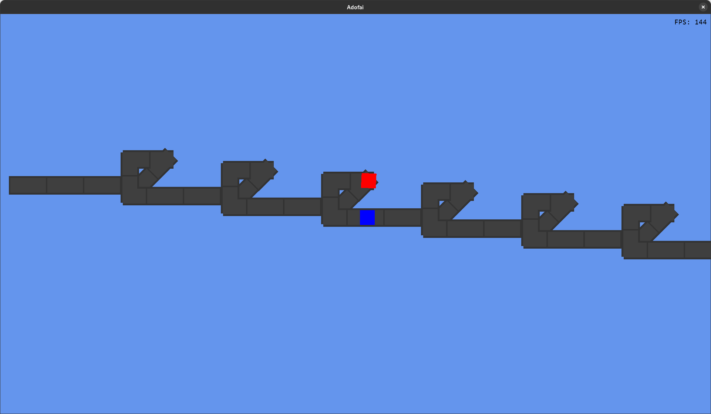

# Alternative Client for  ADOFAI
## A alternative client for A Dance of Fire and Ice written in MonoGame

This is a simple client for A Dance of Fire and Ice, designed to have better performance than the original client, all this client is designed to do is to load custom levels.

### This client is in early development, dont expect all levels to work with this client

# How do I install this?

1. Go to the Releases Page ([https://github.com/Calcilore/AdofaiClient/releases/latest]())
2. Download the latest version for your computer 
3. Extract and run

# How do I use this?

## Opening the file just opens and immediately closes the window
You run the file with the command line arguments of the file you want to open

for example:  
Adofai.exe C:\Users\Username\Downloads\level.adofai

You can also add -a or --auto for autoplay, or get more usages with --help

You could also open the level by right clicking on the .ADOFAI file and opening it with Adofai.exe

## Where are my custom 

Your custom levels are located in "< Your Steam Folder >/steamapps/workshop/content/977950/" 

#### Your steam folder is different depending on the OS you use
On Windows its located at: C:\Program Files (x86)\Steam  
On Linux its located at: ~/.local/share/Steam  
On Linux using flatpak: ~/.var/app/com.valvesoftware.Steam/data/Steam/
